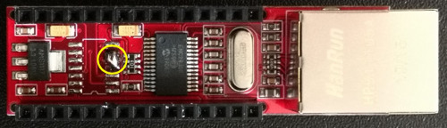
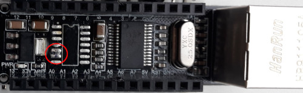

### ENC28J60 with 5 V MCU

ENC28J60 is 5 V tolerant on data pins. This means it can be directly connected to 5 V SPI and reset pins of host MCU. The 5 V AVR MCUs read everything above 3 V as HIGH. This means there is no need to add level conversion between a 5 V AVR MCU and the ENC28J60.

The ENC8266 is powered by 3.3 V and can require 180 mA as top current draw while sending a packet over Ethernet cable. 3.3 V pins on common 5 V Arduino boards can't deliver this current. Uno and Mega R3 can supply max 150 mA on 3.3 V pin and the small Arduinos like Nano and Mini only around 50 mA. This means, for use with a 5 V Arduino use ENC28J60 modules with 5 V VCC option and power them from the 5 V pin.

### Nano Ethernet Shield

There are at least 3 versions of the Nano Ethernet shield in shops. Black version is by Robotdyn, red and blue version are from different manufacturers. All these shields use the same [schematics](https://www.open-electronics.org/low-cost-ethernet-shield-with-enc28j60/), but Robotdyn has a different PCB layout. The shields use logic gates (74HCT08) instead of a Tri-State Digital Buffer (74HC125) to convert the MISO line to 5 V . This creates problems. SPI device not selected by CS pin should release the MISO line by setting the output pin to HI-Z state. The enc28j60 of course does this, but the logic gate can't. It stays HIGH, blocking the bus. No other device can be used on SPI with this shield attached. (Many 5 V SD card adapters have the same problem with the level conversion on the MISO line.)

The new 3.3 V Nano boards could be damaged by this shield, while without the 5 V conversion the shield would be OK for a 3.3 V Nano. This applies to any 3.3 V MCU with this shield wired as module.

To remove the unnecessary conversion to 5 V, remove the 74HCT08 chip from the shield and connect the contact with a trace to pin 12 to the contact to enc28j60 MISO pin. The 74HCT08 has 4 logical AND channels. The shield uses two of them as buffers by tying both inputs together (1 and 1 is 1, 0 and 0 is 0). If you want to use the wake-on-lan function then connect the contact with the trace to pin 2 to the inputs of the channel. You can determine the right contact by following the trace or by measuring the continuity with a multimeter.

Modification of the common version:

Modification of the Robotdyn version:

